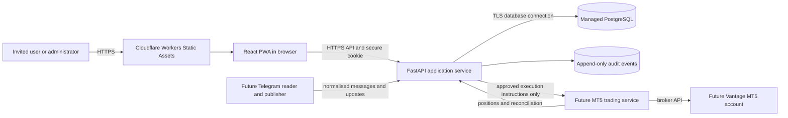

# Super Signals architecture

This document records the foundation architecture at the end of Day 7. Components marked as future are deliberately not connected to live Telegram or broker accounts yet.

## System diagram

## Trust boundaries

1. **Public browser boundary** — everything shipped in `apps/web` is public. No credential or secret may use a `VITE_` variable.
2. **Application boundary** — authentication, permissions, validation and audit writes belong in FastAPI, never only in the interface.
3. **Database boundary** — the browser does not connect directly to PostgreSQL. Backend database credentials remain server-side.
4. **Telegram boundary** — future reader sessions are high-value credentials and must be encrypted, isolated and revocable.
5. **Broker boundary** — future MT5 credentials and execution permissions are limited to the trading service. The web app never receives them.
6. **Environment boundary** — local, CI, preview and production use separate configuration and must not share live secrets or databases.

## Current foundation

Implemented:

- React and TypeScript mobile-first shell on Cloudflare Workers Static Assets
- FastAPI health, authentication and role-protected routes
- server-side hashed sessions and safe recovery responses
- PostgreSQL migrations for users, roles, permissions, invitations, Telegram metadata, messages, signals, positions and immutable audit events
- Owner Admin, Trading Admin and Invited User permission matrix
- CI checks against disposable PostgreSQL

Not yet deployed or enabled:

- hosted FastAPI service
- Telegram reader or publisher
- MT5 connection and execution service
- live trading
- direct user access to Supabase

## Data flow rule

Every external event must become an internal, traceable event before it can affect a trade. Telegram text will be retained as an original message, parsed into a separate signal record, evaluated against explicit rules and only then converted into one or more planned positions. Unknown or ambiguous input is skipped rather than guessed.
